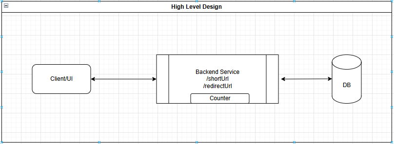
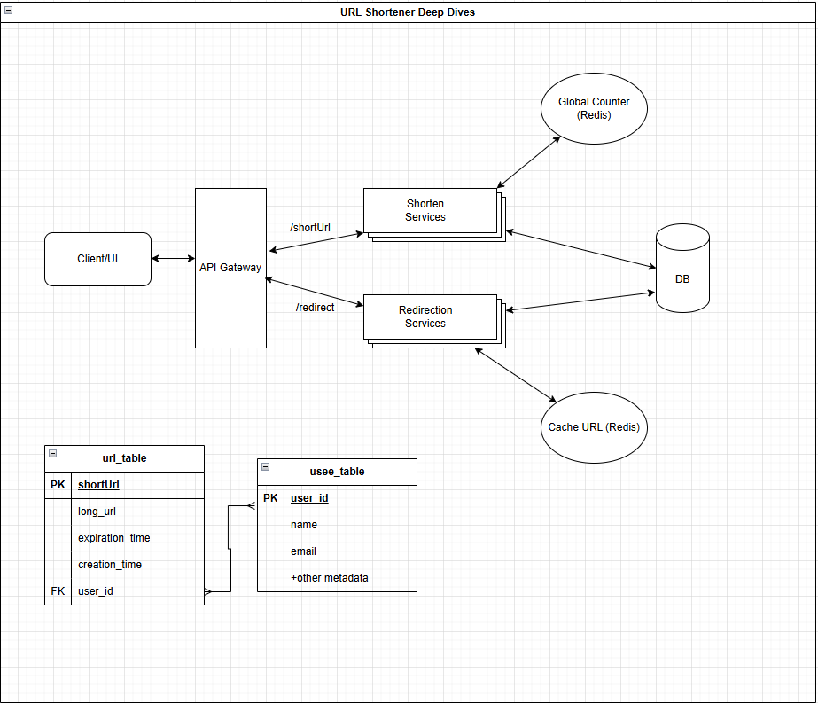

# URL Shortener System Design

## 1. Requirements

### Functional Requirements
- Create a short URL from a long URL
    - Optional: Support for custom alias
    - Optional: URL expiration
- Redirect to the original long URL from the short URL

### Non-Functional Requirements
- Low latency on redirects (~200–300ms)
- Support for 100M Daily Active Users (DAU) and 1–4 billion URLs
- Short URL must be unique
- System should be highly available with eventual consistency for URL shortening

---

## 2. Entities

### `url_table`
- `short_url` (Primary Key)
- `long_url`
- `expiration_time`
- `creation_time`
- `user_id`

### `user_table`
- `user_id` (Primary Key)
- `name`
- `email`
- Other metadata

---

## 3. API & Interface

### Shorten a URL
- **POST** `/shorten`
    - **Payload**: `longUrl`, `alias`, `expirationTime`

### Redirect URL
- **GET** `/{shortUrl}` → Redirect to original long URL

---

## 4. High-Level Design

---

## 4. Deep Dives

### Redirection Options
    1. 302 redirect (temporary)
        - Every time request hit our server
        - Useful when we want to track and do analytics
    2. 301 redirect (permanent)
        - Never hit our server after 1st hit
        - Cache at middleware/DNS
        - We will not able to do any analytics

### Generate short url

    1. Prefix of the long url
        - duplication is the problem if url starts with same characters
    2. Generate random number (10^9 10 charachters)
        - Collisions can occurs
        - Need to query db to check uniqueness
    3. Hash the long url
        - It gives unique hash code
        - But still need to query db to check uniqueness
    4. Counter (Better approach)
        - incrementing a counter -> base62
        - Bad for security if predictable (Trade off)
            - Solution could be
                - "WARN: dont shorten private urls"
                - Add rate limiting to avoid
    5. Bijective function

### Database scaling
    - As system have more read than writes, we can
        - create replicas
        - add indexing 
        - add another hash base indexing

### Caching
    - Cache the urls for faster response
    - Read through and LRU cache
    - Key: shortUrl, value: longUrl
